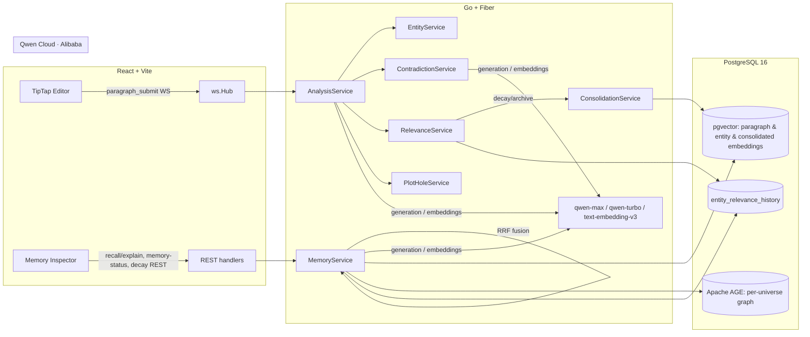

# Plan Maestro 2: Quill → de "muy bueno" a CLARO GANADOR (Track 1 · MemoryAgent)

> **Documento secuela de** [`implementation_plan.md`](file:///home/daikyri/Workspace/Hackathon-QwenCloud/Docs/implementation_plan.md).
> Aquel plan **ya se implementó**: `ContextBudgetManager`, RRF fusion, consolidación por decay,
> `MemoryStatus` y el `ContextPanel` con sparkline **existen en el código hoy**. Este documento
> NO reimplementa nada de eso: lo **eleva, mide y hace visible** para convertir una propuesta
> técnicamente fuerte en la propuesta que un juez elige en 3 minutos.

---

## 0. Resumen Ejecutivo

Track 1 (MemoryAgent) puntúa, en el 30% de *Technical Depth*, **tres capacidades textuales**:
*(1) storage/retrieval eficiente a escala, (2) olvido oportuno de información obsoleta, (3) recall
de memorias críticas en ventanas de contexto limitadas.* Quill **ya construyó las tres**. El problema
no es el motor — es que:

1. **Nadie puede VER el motor.** La sofisticación (RRF, decay→consolidación, budget knapsack) ocurre
   invisible o enterrada en un side-rail del editor. Sofisticación que el juez no ve = sofisticación que no puntúa.
2. **Nadie puede MEDIR el motor.** Las reglas piden "at scale" y "smart recall"; no existe un solo
   número (recall@k, latencia, precisión de forgetting) que lo demuestre. Un juez técnico distingue
   "creemos que funciona" de "medimos que funciona".
3. **Nadie puede ENTENDER las decisiones de diseño.** README = 58 líneas, menciona "memory" una vez.
   No hay diagrama de arquitectura (que además es **requisito de submission**), ni doc de decisiones de memoria.

Este plan ataca esos tres huecos con **4 soluciones**, ordenadas por impacto/dependencia:

| # | Solución | Criterio principal | Depende de |
|---|----------|--------------------|------------|
| **S1** | **Memory Evaluation Harness & Benchmark** — mide recall@k, MRR, nDCG, latencia vs. escala, precisión de forgetting, y ablation RRF-vs-single | Technical Depth 30% + Innovation 30% | — |
| **S2** | **RRF Fusion Explain endpoint** — expone la contribución por-pipeline de cada memoria recuperada | Technical Depth 30% | — |
| **S3** | **"Memory Theater" — página Memory Inspector de primera clase** — decay timeline hero, fusion explorer, budget theater, trigger de decay en vivo | Presentation 15% + arrastra el 30% técnico a cámara | S2 |
| **S4** | **Documentación, Diagrama de Arquitectura y Reencuadre de Tema** — README, `ARCHITECTURE.md` (Mermaid), `MEMORY_DESIGN.md` (ADR), guion de demo | Presentation 15% + Stage One + Problem Value 25% | S1, S3 |

### Fuera de alcance (decisión explícita del autor)
- **NO** se implementa memoria de preferencias/estilo del escritor. Requiere UX de dominio (herramientas
  de autor) que no vamos a improvisar. En su lugar, S4 **reencuadra narrativamente** lo ya existente para
  cubrir la cláusula "remembers user preferences" del pitch de Track 1 (ver §S4.4), sin construir producto nuevo.

### Corrección de honestidad respecto al análisis previo
Un análisis preliminar afirmó que "las joyas de memoria no están testeadas". **Es falso y se corrige aquí.**
La cobertura unitaria es amplia: `context_budget_test.go` (160), `memory_service_test.go` (199),
`fuse_rrf_test.go` (67), `relevance_service_test.go` (477), `consolidation_service_test.go` (378),
`memory_status_test.go` (180), más repos (`entity_relevance_history_repo_test.go`, `consolidation_repo_test.go`,
`vector_repo_test.go`). Los ⚠️ "no covering tests" de CodeGraph apuntaban a *símbolos struct*, no a comportamiento.
**El hueco real NO es cobertura unitaria — es la ausencia de un harness de EVALUACIÓN** (calidad y escala),
que es justo lo que S1 aporta y lo que casi ningún competidor traerá.

---

## 1. Estado Actual (línea base sobre la que se construye)

Antes de tocar nada, esto es lo que YA existe y funciona. Todo el plan se apoya en estos símbolos reales.

### Backend — subsistema de memoria
| Símbolo | Archivo | Qué hace |
|---|---|---|
| `Tokenizer.CountTokens` | `backend/internal/services/tokenizer.go` | conteo de tokens (cl100k_base, fallback ~4 chars/token) |
| `ContextBudgetManager` | `backend/internal/services/context_budget.go` | `ComputeBudget` (split 35/40/25), `FitToBudget` (greedy knapsack por score), `BudgetReport` |
| `MemoryService.RecallWithQuery` | `backend/internal/services/memory_service.go:165` | fusiona 5 pipelines vía RRF: vector, graph, recency, keyword, consolidated |
| `fuseRRF` | `backend/internal/services/memory_service.go:47` | Reciprocal Rank Fusion, `rrfK=60`, dedupe por id, orden determinista |
| `MemoryService.fitToBudget` | `backend/internal/services/memory_service.go:396` | recorta la lista fusionada al `VectorTokens` del budget |
| `RelevanceService.DecayAll` | `backend/internal/services/relevance_service.go:102` | decay exponencial event-driven + archivado por umbral + snapshot de historia + consolidación fire-and-forget |
| `RelevanceService.Touch` / `.Reactivate` | idem | reset de idle al mencionar / reactivación (score 0.8) + deconsolidación |
| `ConsolidationService.ConsolidateEntity` | `backend/internal/services/consolidation_service.go:46` | resume menciones con qwen-turbo → summary + key_facts + embedding |
| `MemoryService.MemoryStatus` | `backend/internal/services/memory_status.go` | snapshot lifecycle + historia de relevancia por entidad |

### Backend — endpoints y protocolo
- REST: `POST /api/v1/universes/:id/recall`, `GET /api/v1/universes/:id/memory-status`,
  `GET /api/v1/universes/:universe_id/graph`, `GET /api/v1/entities/:id/neighbors`.
- WS (`backend/internal/ws/protocol.go`): `recall_request` → `contextual_recall`; `analysis_progress`
  con stage `context_budget` que transporta `BudgetReport`.
- Config (`backend/internal/config`): `DECAY_LAMBDA=0.1`, `ARCHIVE_THRESHOLD=0.15`,
  `QWEN_MAX_CONTEXT_TOKENS=30000`, `QWEN_RESPONSE_RESERVE=2000`.
- Migraciones relevantes: `017_create_consolidated_memories`, `018_add_fulltext_index`,
  `019_create_entity_relevance_history`, `015_add_hnsw_indexes`.

### Frontend
- `ContextPanel.tsx` (componente `ContextPanel`, 328 líneas, montado como side-rail en `EditorPage.tsx`):
  ya tiene **Live Pipeline stepper**, **Context Budget meter**, **Retrieval Sources badges**,
  **Entity Lifecycle sparkline** (SVG inline, sin librería de charts).
- `frontend/src/lib/api.ts`: `getGraph`, `recall`, `getMemoryStatus`.
- `frontend/src/stores/wsStore.ts`: slices `budget: BudgetReport|null`, `pipeline`, `recallItems`.
- Paleta en `frontend/src/index.css` (tokens: `--ink`, `--gold`, `--node-*`, `--success`, `--danger`, `--muted`, `--line`…).
  Restricción de `design.md`: "ancient manuscript", solo tinta/papel, serif para títulos, **sin librerías de UI plana**.

> **Regla transversal de implementación (ponytail):** no se agrega ninguna dependencia de charting.
> Todo gráfico nuevo es SVG inline, coherente con el `Sparkline` ya existente y con `design.md`.

---

## SOLUCIÓN 1: Memory Evaluation Harness & Benchmark
### Criterio atacado: Technical Depth (30%) — *"efficient storage/retrieval at scale"* + Innovation (30%) — *"performance optimization, custom components"*

> [!CAUTION]
> Este es el **diferenciador #1**. Las reglas piden "at scale" y "smart recall"; hoy no hay ni un número.
> Casi ningún participante de hackathon trae un eval de memoria reproducible. Traerlo te separa del pelotón.

### 1.1 El Problema
El motor de memoria es bueno, pero su calidad es **una afirmación, no un hecho medido**:
- No sabemos el **recall@k** (¿el RRF recupera las memorias correctas?).
- No sabemos si la **fusión RRF supera a un pipeline solo** (¿el RRF aporta lift o es decoración?).
- No sabemos la **latencia vs. tamaño de corpus** (¿"escala" es real o aspiracional?).
- No sabemos la **precisión del forgetting** (¿`DecayAll` archiva lo que debe y retiene lo que importa?).
- No sabemos si la **consolidación preserva información** (¿el summary de qwen-turbo conserva los key facts?).

Sin esto, en el 30% técnico competís con prosa. Con esto, competís con una tabla de resultados.

### 1.2 La Solución Completa
Un paquete Go `backend/eval/` que:
1. **Siembra un corpus etiquetado** (gold labels) en una DB de test (reutiliza `testutil.RunMigrationsUpTo`
   + el seed existente `014_seed_demo_saga` como base, aumentado con un JSON de gold queries).
2. **Corre métricas de IR** sobre `RecallWithQuery`: recall@k, precision@k, MRR, nDCG@k para k ∈ {1,3,5,10}.
3. **Ablation**: mismo corpus con fusión completa vs. cada pipeline aislado → tabla de "lift del RRF".
4. **Latencia vs. escala**: mide `RecallWithQuery` p50/p95 con N ∈ {50, 200, 1000, 5000} entidades.
5. **Forgetting**: simula avance de capítulos, corre `DecayAll`, mide precisión/recall de archivado
   contra un set etiquetado de "debería archivarse".
6. **Fidelidad de consolidación**: similaridad coseno entre embedding del summary consolidado y el
   centroide de las menciones originales (¿comprime sin perder el hilo?).
7. **Emite artefactos**: `Docs/eval/results.md` (tablas markdown) + `Docs/eval/results.csv` para graficar.

```
backend/eval/
├── corpus/
│   ├── saga_gold.json        # queries + entity/fact IDs relevantes (gold), timeline de capítulos
│   └── README.md             # cómo se etiquetó el corpus (metodología, reproducibilidad)
├── metrics.go                # recallAtK, precisionAtK, mrr, ndcgAtK (funciones puras + tests)
├── metrics_test.go           # tests de las métricas con casos conocidos (no toca DB)
├── corpus.go                 # carga saga_gold.json → structs GoldQuery/GoldLabel
├── seed.go                   # ingesta del corpus en la DB de test (reusa repos reales)
├── harness_test.go           # TestMemoryEval* — gated por TEST_DATABASE_URL, escribe artefactos
└── report.go                 # renderiza results.md + results.csv
```

> **Decisión (ponytail):** el harness es un **`go test` gated por `TEST_DATABASE_URL`**, NO un servicio ni
> un CLI nuevo. Reusa `testutil.RunMigrationsUpTo` y los repos reales. Cero infra nueva. Se corre con
> `TEST_DATABASE_URL=... go test ./backend/eval/ -run TestMemoryEval -v`. Los artefactos quedan versionados.

#### 1.2.1 Métricas (funciones puras, testeables sin DB)

**Archivo nuevo:** `backend/eval/metrics.go`

```go
package eval

import (
	"math"
	"sort"
)

// recallAtK = |relevantes recuperados en top-k| / |relevantes totales|.
// retrieved viene ordenado por score desc; relevant es el set de IDs gold.
func recallAtK(retrieved []string, relevant map[string]bool, k int) float64 {
	if len(relevant) == 0 {
		return 0
	}
	hits := 0
	for i, id := range retrieved {
		if i >= k {
			break
		}
		if relevant[id] {
			hits++
		}
	}
	return float64(hits) / float64(len(relevant))
}

// precisionAtK = |relevantes en top-k| / k.
func precisionAtK(retrieved []string, relevant map[string]bool, k int) float64 {
	if k == 0 {
		return 0
	}
	hits := 0
	for i, id := range retrieved {
		if i >= k {
			break
		}
		if relevant[id] {
			hits++
		}
	}
	return float64(hits) / float64(k)
}

// mrr = 1 / (rank del primer relevante), 0 si ninguno aparece.
func mrr(retrieved []string, relevant map[string]bool) float64 {
	for i, id := range retrieved {
		if relevant[id] {
			return 1.0 / float64(i+1)
		}
	}
	return 0
}

// ndcgAtK con ganancia binaria (rel ∈ {0,1}) e IDCG ideal.
func ndcgAtK(retrieved []string, relevant map[string]bool, k int) float64 {
	dcg := 0.0
	for i, id := range retrieved {
		if i >= k {
			break
		}
		if relevant[id] {
			dcg += 1.0 / math.Log2(float64(i+2)) // i+2 porque log2(1)=0
		}
	}
	idealHits := len(relevant)
	if idealHits > k {
		idealHits = k
	}
	idcg := 0.0
	for i := 0; i < idealHits; i++ {
		idcg += 1.0 / math.Log2(float64(i+2))
	}
	if idcg == 0 {
		return 0
	}
	return dcg / idcg
}

var _ = sort.Strings // sort usado en report.go para orden determinista
```

**Archivo nuevo:** `backend/eval/metrics_test.go` — casos conocidos (sin DB):
```go
// Ej.: retrieved=[A,B,C,D], relevant={A,C}
//   recall@2 = 1/2 (solo A en top-2)   → assert 0.5
//   recall@4 = 2/2 = 1.0
//   mrr = 1/1 = 1.0 (A es rank 1)
//   ndcg@4 = (1/log2(2) + 1/log2(4)) / (1/log2(2) + 1/log2(3))
```

#### 1.2.2 Corpus de gold labels

**Archivo nuevo:** `backend/eval/corpus/saga_gold.json`
```json
{
  "universe_seed": "014_seed_demo_saga",
  "queries": [
    {
      "id": "q1",
      "query": "Who betrayed the northern kingdom?",
      "relevant_entity_names": ["Lord Varric", "The Iron Pact"],
      "note": "Traición establecida en cap. 3, mencionada de nuevo en cap. 9"
    }
  ],
  "forgetting_timeline": {
    "total_chapters": 12,
    "should_be_archived_by_chapter_12": ["Minor Innkeeper", "Village of Thornwood"],
    "must_stay_active": ["Lord Varric", "Queen Aeliana"]
  }
}
```
> El corpus se construye a partir del seed `014_seed_demo_saga` (ya existe una saga multi-capítulo).
> Los `relevant_entity_names` se resuelven a UUIDs en `seed.go` tras la ingesta. La metodología de
> etiquetado se documenta en `corpus/README.md` para defender reproducibilidad ante un juez.

#### 1.2.3 Harness principal

**Archivo nuevo:** `backend/eval/harness_test.go`
```go
//go:build integration

package eval

// TestMemoryEvalRecall siembra el corpus, corre RecallWithQuery por cada gold query,
// calcula recall@k/precision@k/mrr/ndcg agregados y escribe la tabla a Docs/eval/results.md.
func TestMemoryEvalRecall(t *testing.T) {
	pool := testutil.RequireDB(t)                 // t.Skip si no hay TEST_DATABASE_URL
	testutil.RunMigrationsUpTo(t, pool, "014")    // seed saga incluido
	svc := buildRealMemoryService(t, pool)        // repos + budgetMgr reales

	gold := loadGold(t, "corpus/saga_gold.json")
	resolveGoldIDs(t, pool, gold)                 // nombres → UUIDs

	var agg metricsAccumulator
	for _, q := range gold.Queries {
		emb := embedQuery(t, q.Query)             // QwenService.GenerateEmbedding
		items, err := svc.RecallWithQuery(ctx, universeID, emb, q.Query, 10)
		require.NoError(t, err)
		ids := entityIDs(items)
		agg.add(q, ids)                           // acumula recall@k/mrr/ndcg
	}
	writeRecallReport(t, "../../Docs/eval/results.md", agg)  // append sección
}

// TestMemoryEvalAblation corre cada query en 5 modos: RRF-full y 4 single-pipeline,
// para demostrar el lift de la fusión. Requiere el refactor de S2 (runPipelines expuesto).
// TestMemoryEvalLatency mide p50/p95 de RecallWithQuery a N∈{50,200,1000,5000} entidades.
// TestMemoryEvalForgetting avanza capítulos, corre DecayAll, mide precisión de archivado.
// TestMemoryEvalConsolidationFidelity mide coseno(summary_embedding, mentions_centroid).
```

> **Nota de dependencia:** `TestMemoryEvalAblation` necesita poder correr pipelines aislados. Eso se
> habilita con el refactor `runPipelines` de **S2.2.1** (extraer los 5 pipelines a un método reusable).
> Por eso S1 y S2 comparten ese refactor y conviene hacerlo primero.

#### 1.2.4 Artefacto de salida

**Archivo generado (versionado):** `Docs/eval/results.md`
```markdown
# Quill Memory Subsystem — Evaluation Results
Corpus: 014_seed_demo_saga · 12 chapters · 47 entities · 210 paragraphs · generated <fecha>

## Recall Quality (n=<Q> gold queries)
| Metric | k=1 | k=3 | k=5 | k=10 |
|--------|-----|-----|-----|------|
| Recall@k   | ... | ... | ... | ...  |
| nDCG@k     | ... | ... | ... | ...  |
| MRR        | ...             |

## RRF Fusion Lift (ablation)
| Retrieval mode | Recall@5 | nDCG@5 |
|----------------|----------|--------|
| Vector only    | ...      | ...    |
| Graph only     | ...      | ...    |
| Keyword only   | ...      | ...    |
| **RRF (all)**  | **...**  | **...**|

## Latency vs. Scale (RecallWithQuery)
| Entities | p50 (ms) | p95 (ms) |
|----------|----------|----------|
| 50 / 200 / 1000 / 5000 | ... | ... |

## Forgetting Precision (DecayAll after 12 chapters)
Archived-correctly: .../...  ·  False-archives (retención perdida): ...
Consolidation fidelity (cosine summary↔mentions): mean ...
```

### 1.3 Desglose en tareas ejecutables
- [ ] **T1.1** Crear `backend/eval/metrics.go` + `metrics_test.go` (funciones puras, `go test ./backend/eval/` verde sin DB).
- [ ] **T1.2** Crear `corpus/saga_gold.json` + `corpus/README.md` etiquetando el seed `014_seed_demo_saga`.
- [ ] **T1.3** Crear `corpus.go` (load + resolveGoldIDs) y `seed.go` (helpers de ingesta reusando repos reales).
- [ ] **T1.4** Crear `harness_test.go::TestMemoryEvalRecall` + `report.go` (writeRecallReport).
- [ ] **T1.5** `TestMemoryEvalAblation` (tras el refactor S2.2.1).
- [ ] **T1.6** `TestMemoryEvalLatency` (genera N entidades sintéticas, mide con `time.Now()` p50/p95).
- [ ] **T1.7** `TestMemoryEvalForgetting` + `TestMemoryEvalConsolidationFidelity`.
- [ ] **T1.8** Correr el harness contra `docker compose up postgres`, commitear `Docs/eval/results.md` + `.csv`.
- [ ] **T1.9** Añadir a `CLAUDE.md`/README el comando de reproducción del eval.

---

## SOLUCIÓN 2: RRF Fusion Explain Endpoint
### Criterio atacado: Technical Depth (30%) — *"non-trivial logic, advanced patterns"* (hace auditable el algoritmo estrella)

### 2.1 El Problema
`RecallWithQuery` fusiona 5 pipelines y devuelve **solo el resultado final** con las fuentes unidas por coma
(`memory_service.go:271`). La lógica más valiosa del proyecto — cómo el RRF combina rankings independientes —
es una **caja negra**. Ni el frontend ni un juez pueden ver *por qué* una memoria quedó rankeada donde quedó.
Sin exponer la contribución por-pipeline, el "Fusion Explorer" de S3 no tiene datos que mostrar.

### 2.2 La Solución Completa
Refactor mínimo + un método `RecallExplain` + un endpoint REST. **No cambia el comportamiento de `RecallWithQuery`**;
extrae su primera mitad a un método reusable y añade una variante instrumentada.

#### 2.2.1 Refactor: extraer `runPipelines` (reusado por Recall, RecallExplain y el ablation de S1)

**Archivo a modificar:** `backend/internal/services/memory_service.go`

```go
// pipelineSet agrupa la salida cruda de los 5 pipelines antes de fusionar.
type pipelineSet struct {
	Vector       []rankedEntry
	Graph        []rankedEntry
	Recency      []rankedEntry
	Keyword      []rankedEntry
	Consolidated []rankedEntry
}

// runPipelines ejecuta los 5 pipelines (misma lógica que hoy vive inline en
// RecallWithQuery) y devuelve sus rankings crudos. Extraído para que Recall,
// RecallExplain y el harness de evaluación compartan exactamente el mismo camino.
func (s *MemoryService) runPipelines(ctx context.Context, universeID uuid.UUID, queryEmbedding []float32, queryText string, k int) (pipelineSet, error) {
	// ... mueve aquí las líneas 166-252 actuales de RecallWithQuery
	//     (list active, sort, seeds, wg con graph/keyword/consolidated) ...
}
```
`RecallWithQuery` queda como:
```go
func (s *MemoryService) RecallWithQuery(ctx context.Context, universeID uuid.UUID, queryEmbedding []float32, queryText string, k int) ([]models.RecallItem, error) {
	ps, err := s.runPipelines(ctx, universeID, queryEmbedding, queryText, k)
	if err != nil {
		return nil, err
	}
	fused := fuseRRF(ps.Vector, ps.Graph, ps.Recency, ps.Keyword, ps.Consolidated)
	if s.budgetMgr != nil {
		fused = s.fitToBudget(fused)
	}
	if k > 0 && len(fused) > k {
		fused = fused[:k]
	}
	return toRecallItems(fused), nil   // helper extraído de las líneas 264-273
}
```
> **Riesgo (blast radius):** `RecallWithQuery` tiene 3 callers (`ws/hub.go`, `handlers/graph.go`,
> `analysis_service.go`) y test `memory_service_test.go`. El refactor es **comportamiento-preservante**;
> los tests existentes deben pasar sin cambios → son la red de seguridad.

#### 2.2.2 `fuseRRFExplain` — variante que registra contribuciones

**Archivo a modificar:** `backend/internal/services/memory_service.go`
```go
// RRFContribution registra el aporte de un pipeline a un item fusionado.
type RRFContribution struct {
	Pipeline string  `json:"pipeline"`  // "vector"|"graph"|"recency"|"keyword"|"consolidated"
	Rank     int     `json:"rank"`      // 1-indexed dentro de ese pipeline
	Delta    float64 `json:"delta"`     // 1/(rrfK+rank)
}

type ExplainedItem struct {
	ID            string            `json:"id"`
	EntityID      uuid.UUID         `json:"entity_id"`
	Fact          string            `json:"fact"`
	RRFScore      float64           `json:"rrf_score"`
	Contributions []RRFContribution `json:"contributions"`
	FitInBudget   bool              `json:"fit_in_budget"`
}

// fuseRRFExplain es fuseRRF que además acumula, por item, el delta y rank de cada
// pipeline que lo aportó. Mismo cálculo — no diverge del score de producción.
func fuseRRFExplain(named map[string][]rankedEntry) []ExplainedItem { /* ... */ }
```

#### 2.2.3 `RecallExplain` + endpoint

**Archivo a modificar:** `backend/internal/services/memory_service.go`
```go
type RecallExplanation struct {
	Query    string          `json:"query"`
	Pipelines map[string]int `json:"pipeline_sizes"` // cuántos items aportó cada pipeline
	Items    []ExplainedItem `json:"items"`          // fusionado, con contribuciones y flag de budget
	Budget   BudgetReport    `json:"budget"`         // reusa el reporte existente
}

func (s *MemoryService) RecallExplain(ctx context.Context, universeID uuid.UUID, queryEmbedding []float32, queryText string, k int) (RecallExplanation, error) {
	ps, err := s.runPipelines(ctx, universeID, queryEmbedding, queryText, k)
	// fuseRRFExplain → marcar FitInBudget usando budgetMgr.FitToBudget → armar BudgetReport
}
```

**Archivo a modificar:** `backend/internal/handlers/graph.go`
```go
// RecallExplain expone el detalle de fusión RRF para el Memory Inspector.
// POST /api/v1/universes/:id/recall/explain   Body: {"query":"...", "k":10}
func (h *GraphHandler) RecallExplain(c *fiber.Ctx) error { /* embed query, call svc.RecallExplain */ }
```
> El embedding del query se hace en el handler vía `QwenService.GenerateEmbedding` (igual patrón que
> `ws/hub.go::handleRecallRequest`). Requiere inyectar el embedder en `GraphHandler` **o** que el handler
> reciba un query ya embebido; lo simple: añadir `embedder EmbeddingProvider` al `GraphHandler`
> (interfaz mínima ya definida en `ws/hub.go`, reutilizable).

**Archivo a modificar:** `backend/cmd/server/main.go` — registrar la ruta y pasar el embedder al handler.

**Archivo a modificar:** `frontend/src/lib/api.ts`
```ts
recallExplain: (universeId: string, query: string, k = 10) =>
  post<RecallExplanation>(`/universes/${universeId}/recall/explain`, { query, k }),
```

### 2.3 Desglose en tareas ejecutables
- [ ] **T2.1** Extraer `runPipelines` + `toRecallItems` de `RecallWithQuery` (refactor puro; correr `go test ./internal/services/` verde).
- [ ] **T2.2** Añadir `RRFContribution`, `ExplainedItem`, `fuseRRFExplain` + test unitario (mismo score que `fuseRRF` para el mismo input).
- [ ] **T2.3** Añadir `RecallExplanation` + `MemoryService.RecallExplain` + test.
- [ ] **T2.4** Añadir `embedder` a `GraphHandler`, `RecallExplain` handler, ruta en `main.go`, test de handler (`graph_test.go`).
- [ ] **T2.5** `api.ts::recallExplain` + tipos TS espejo (`RecallExplanation`, `ExplainedItem`, `RRFContribution`).

---

## SOLUCIÓN 3: "Memory Theater" — Página Memory Inspector de Primera Clase
### Criterio atacado: Presentation (15%) — *"key logic visualized effectively"* + hace VISIBLE el 30% técnico

### 3.1 El Problema
Toda la memoria vive hoy en `ContextPanel` (`ln`), un **side-rail estrecho del editor**. Está bien como
utilidad, pero es ilegible para un juez en un video de 3 minutos: es pequeño, comparte espacio con el editor,
y **no muestra la joya** — no ves la curva de decay a lo largo de capítulos, no ves cómo el RRF fusionó
los pipelines, no ves el knapsack de budget decidir qué entra y qué se descarta. Los tres pilares de Track 1
(storage/retrieval, forgetting, recall-en-budget) tienen que ser **una escena de cámara, no un widget lateral**.

### 3.2 La Solución Completa
Una **ruta dedicada** `/:universeId/memory` (tab nueva en `UniverseLayout`), página `MemoryInspectorPage`,
con **tres actos** que mapean 1:1 a los tres focos del rubric. Reutiliza el data-plumbing existente
(`api.getMemoryStatus`, `wsStore.budget`, `api.recallExplain` de S2). SVG inline, tokens de `index.css`,
coherente con `design.md`. **Cero librería de charts nueva.**

```
frontend/src/pages/MemoryInspectorPage.tsx        (ruta: /:universeId/memory)
frontend/src/components/memory/
├── DecayTimeline.tsx        ACTO 1 — Forgetting: score vs. capítulo por entidad,
│                            línea de umbral (0.15), marcadores archive/reactivate
├── FusionExplorer.tsx       ACTO 2 — Recall: query box → recallExplain → columnas por
│                            pipeline + resultado fusionado con barras de contribución RRF
├── BudgetTheater.tsx        ACTO 3 — Budget: barras de tokens (entities/vector/tools),
│                            fitted vs dropped, % de ventana usada
└── memory.module.css
```

#### 3.2.1 ACTO 1 — `DecayTimeline` (Forgetting visible)
Consume `api.getMemoryStatus(universeId)` → `MemoryStatusEntity[]` (ya tiene `history: {score, recorded_at}[]`,
`status`, `lifecycle`, `consolidated`). Renderiza un multi-línea SVG:
- Eje Y = relevance score (0..1), eje X = índice de snapshot (capítulos).
- **Línea de umbral** horizontal en `ARCHIVE_THRESHOLD` (0.15) — el "nivel del mar del olvido".
- Cada entidad = una polyline; color por `lifecycle` (`--success` activo, `--muted` decaying,
  `--danger` archived, `--gold` consolidated, `--node-worldrule` reactivated).
- **Marcadores**: punto ▼ donde cruza el umbral (archivado), punto ▲ en reactivación.
- Panel lateral: al hover una entidad, muestra su `key_facts` consolidados (de `consolidated`=true).
> Reutiliza la lógica de escalado del `Sparkline` existente en `ContextPanel.tsx:49`, escalada a hero-size.
> **Trigger de demo (clave para el video):** botón **"Advance chapter → run decay"** que llama un endpoint
> nuevo `POST /api/v1/universes/:id/decay` → `RelevanceService.DecayAll`, y re-fetchea el timeline.
> Así el juez ve el olvido **ocurrir en vivo**: las líneas caen, una cruza el umbral, se archiva, se consolida.

**Endpoint nuevo (para el trigger de demo):**
```go
// backend/internal/handlers/graph.go  (o un DemoHandler existente si aplica)
// POST /api/v1/universes/:id/decay  → corre un ciclo de decay+archivado+consolidación.
// ponytail: expone DecayAll ya existente; sin lógica nueva de negocio, solo un trigger HTTP.
func (h *GraphHandler) RunDecay(c *fiber.Ctx) error { /* relevanceSvc.DecayAll(ctx, universeID) */ }
```
> Requiere inyectar `RelevanceService` (o una interfaz mínima `Decayer{ DecayAll(ctx, uuid) error }`)
> en el handler. Interfaz mínima, patrón idéntico a `Reactivatr`/`AnalysisHub` ya usados.

#### 3.2.2 ACTO 2 — `FusionExplorer` (Recall + RRF visible)
Caja de texto → `api.recallExplain(universeId, query, 10)` (S2). Render en columnas:
```
┌─ vector ──┐ ┌─ graph ───┐ ┌─ recency ─┐ ┌─ keyword ─┐ ┌─ consolidated ┐    ┌═ RRF FUSED ═════════┐
│ 1. Varric │ │ 1. Pact   │ │ 1. Aeliana│ │ 1. betray │ │ 1. Varric(sum)│ →  │ 1. Varric  0.081 ▓▓▓ │
│ 2. Pact   │ │ 2. Varric │ │ 2. Varric │ │ ...       │ │ ...           │    │    ├ vector  #1 +.016 │
│ ...       │ │ ...       │ │ ...       │ │           │ │               │    │    ├ graph   #2 +.016 │
└───────────┘ └───────────┘ └───────────┘ └───────────┘ └───────────────┘    │    └ keyword #1 +.016 │
                                                                              │ 2. Iron Pact 0.049…  │
                                                                              └══════════════════════┘
```
- Cada item fusionado muestra su `RRFScore` y **desglosa sus `contributions`** (pipeline #rank +delta) —
  esto es literalmente el algoritmo estrella, auditable a simple vista.
- Ítems con `fit_in_budget=false` se muestran atenuados/tachados → conecta con el ACTO 3.

#### 3.2.3 ACTO 3 — `BudgetTheater` (Recall-en-ventana-limitada visible)
Consume el `budget: BudgetReport` de `wsStore` (ya poblado en vivo por el stage `context_budget` del
análisis) y el `budget` del `recallExplain`. Barras horizontales:
```
Context window: 30 000 tokens · used 41%
System   ▓▓ 1 900
User     ▓▓▓ 3 000
Entities ▓▓▓▓▓▓▓▓ 8 785   (35%)
Vector   ▓▓▓▓▓▓▓▓▓▓ 10 040 (40%)  ← 3 memorias FITTED, 2 DROPPED por budget
Tools    ▓▓▓▓▓ 6 275   (25%)
```
- Muestra explícitamente **cuántas memorias entraron y cuántas se descartaron** por el knapsack — la prueba
  visual de "smart recall within limited context windows".

#### 3.2.4 Cableado de ruta y navegación
**Archivo a modificar:** `frontend/src/App.tsx` — añadir `<Route path=":universeId/memory" element={<MemoryInspectorPage/>}/>`
dentro del layout de universo.
**Archivo a modificar:** `frontend/src/pages/UniverseLayout.tsx` — añadir tab "Memory" junto a Graph/Entities/Timeline.
> **No** se toca el `ContextPanel` del editor: sigue como utilidad in-context. El Memory Theater es la
> vista de exhibición. Reutilizan los mismos endpoints → sin duplicar lógica de datos.

### 3.3 Desglose en tareas ejecutables
- [ ] **T3.1** Endpoint `POST /universes/:id/decay` + interfaz `Decayer` en handler + ruta en `main.go` + test.
- [ ] **T3.2** `api.ts`: `runDecay(universeId)`; tipos TS de `MemoryStatusEntity` (ya existe en ContextPanel — extraer a `types.ts` compartible).
- [ ] **T3.3** `DecayTimeline.tsx` (SVG multi-línea + umbral + marcadores + botón trigger) + test.
- [ ] **T3.4** `FusionExplorer.tsx` (columnas por pipeline + fused con contribuciones) + test.
- [ ] **T3.5** `BudgetTheater.tsx` (barras de budget + fitted/dropped) + test.
- [ ] **T3.6** `MemoryInspectorPage.tsx` (compone los 3 actos) + `memory.module.css` (tokens de `index.css`).
- [ ] **T3.7** Ruta en `App.tsx` + tab en `UniverseLayout.tsx` + test de routing.
- [ ] **T3.8** Verificación visual end-to-end con `npm run dev` sobre el seed saga (usar `/verify`).

---

## SOLUCIÓN 4: Documentación, Diagrama de Arquitectura y Reencuadre de Tema
### Criterio atacado: Presentation (15%) — *"clear documentation, architecture docs"* + Stage One (theme-fit) + Problem Value (25%)

### 4.1 El Problema
- README = 58 líneas, "memory" **una vez**. El rubric puntúa literal "architecture docs describing your project".
- **No hay diagrama de arquitectura** — y es un **requisito de submission**, no opcional.
- No hay doc que explique las **decisiones de diseño de memoria** (por qué RRF, por qué k=60, por qué
  event-driven decay, por qué split 35/40/25) — dejás puntos de Technical Depth sobre la mesa.
- El encuadre "MemoryAgent" no está explícito; un juez podría no mapear Quill a los 3 focos de Track 1.

### 4.2 La Solución Completa

#### 4.2.1 README reescrito con sección de memoria
**Archivo a modificar:** `README.md`. Estructura:
1. Tagline reencuadrado: *"Quill — a MemoryAgent for long-form narrative: it accumulates story experience,
   forgets what stops mattering, and recalls the critical few facts within a bounded context window."*
2. Sección **"Memory Subsystem"** con la tabla de los 3 pilares de Track 1 → símbolo del código que lo implementa
   → número del eval (S1):

   | Track-1 focus | Cómo lo hace Quill | Evidencia medida (S1) |
   |---|---|---|
   | Efficient storage/retrieval at scale | pgvector + AGE graph + RRF hybrid fusion de 5 pipelines | recall@5 = …, p95 @5000 ent = … ms |
   | Timely forgetting of outdated info | decay exponencial event-driven → archive → consolidación LLM | forgetting precision = … |
   | Recall in limited context windows | ContextBudgetManager (knapsack) + budget report en vivo | dropped-by-budget = …/… |
3. Link al **eval** (`Docs/eval/results.md`) y al **Memory Inspector** (screenshot).
4. Quickstart (ya existe) + comando de reproducción del eval.

#### 4.2.2 Diagrama de arquitectura (requisito de submission)
**Archivo nuevo:** `Docs/ARCHITECTURE.md` con un diagrama **Mermaid** (renderiza en GitHub, versionable, sin binarios):

> Exportar también un PNG (`Docs/ARCHITECTURE.png`) para embeber en Devpost. El Mermaid es la fuente de verdad.
> El diagrama **resalta el memory store** (pgvector + AGE + relevance_history) y los flujos RRF/decay/consolidación,
> que es exactamente lo que el requisito pide ("memory store included").

#### 4.2.3 `MEMORY_DESIGN.md` — decisiones de diseño (ADR-style)
**Archivo nuevo:** `Docs/MEMORY_DESIGN.md`. Una entrada por decisión, formato ADR (contexto → decisión → alternativas → consecuencia), citando números del eval:
- **ADR-1 · Por qué RRF y no un score ponderado.** RRF es robusto a escalas heterogéneas entre pipelines
  (coseno vs. hops de grafo vs. recency); `k=60` (Cormack et al.). Evidencia: ablation de S1 muestra lift X.
- **ADR-2 · Por qué decay event-driven y no un worker temporal.** Determinismo por capítulo, testeable,
  sin thread de fondo. Trade-off: no decae en tiempo real (irrelevante para escritura).
- **ADR-3 · Por qué consolidar al archivar (no al vuelo).** Comprime memorias frías a summary+key_facts
  (qwen-turbo), preservando recall barato; se deconsolidan al reactivar. Fidelidad medida en S1.
- **ADR-4 · Por qué split 35/40/25 y knapsack greedy por score.** Prioriza memoria vectorial (mayor densidad
  informativa) sin ahogar entidades/tools; greedy con `continue` deja entrar items chicos tras descartar uno grande.
- **ADR-5 · Escala.** HNSW (migración 015) + índice fulltext (018); latencia medida en S1.

#### 4.2.4 Reencuadre de tema (cubre la cláusula "user preferences" sin construir producto)
En README y en el guion de demo, encuadrar **explícitamente**:
> *"El agente acumula EXPERIENCIA (el universo narrativo), OLVIDA lo que deja de importar (decay+consolidación),
> y toma DECISIONES cada vez más precisas a medida que la memoria crece (detección de contradicciones/plot-holes
> que mejora con el corpus). La 'preferencia' que aprende es la coherencia interna del mundo del autor."*

Esto es **verdad sobre el código actual** y mapea la primera oración del pitch de Track 1 sin agregar UX nueva.

#### 4.2.5 Guion de demo (≤ 3 min) — cada plano mapea a un criterio
**Archivo nuevo:** `Docs/DEMO_SCRIPT.md`:
| t | Plano | Criterio que puntúa |
|---|-------|---------------------|
| 0:00–0:20 | Hook + tagline MemoryAgent | Stage One theme-fit |
| 0:20–1:00 | Escribir párrafo → análisis en vivo → contradicción detectada | Problem Value + Innovation |
| 1:00–1:40 | **Memory Inspector ACTO 1**: click "advance chapter" → líneas caen → entidad cruza umbral → se archiva y consolida | Technical Depth (forgetting) |
| 1:40–2:20 | **ACTO 2**: query → Fusion Explorer muestra RRF combinando 5 pipelines | Technical Depth (recall) |
| 2:20–2:40 | **ACTO 3**: Budget Theater — memorias dropped por ventana | Technical Depth (budget) |
| 2:40–3:00 | Pantallazo de `Docs/eval/results.md` (recall@k, lift RRF, latencia) | Technical Depth (at scale) |

### 4.3 Desglose en tareas ejecutables
- [ ] **T4.1** Reescribir `README.md` con sección Memory Subsystem + tabla de 3 pilares + links.
- [ ] **T4.2** Crear `Docs/ARCHITECTURE.md` (Mermaid) + exportar `Docs/ARCHITECTURE.png`.
- [ ] **T4.3** Crear `Docs/MEMORY_DESIGN.md` (ADR-1..5) citando números del eval de S1.
- [ ] **T4.4** Añadir reencuadre "MemoryAgent" a README + `Docs/DEMO_SCRIPT.md`.
- [ ] **T4.5** Rellenar los números del eval en README/MEMORY_DESIGN una vez S1 corre (dependencia).

---

## 5. Plan de Ejecución — 13 días (hasta Jul 20) y dependencias

```
Dependencias:
  S2.refactor(runPipelines) ──┬──> S1.ablation
                              └──> S2(explain endpoint) ──> S3.FusionExplorer
  S1(eval numbers) ──> S4.README/MEMORY_DESIGN
  S3(screenshots) ──> S4.DEMO_SCRIPT / video
```

| Días | Foco | Entregable verificable |
|------|------|------------------------|
| 1–2  | **S2** completo (refactor `runPipelines` + explain endpoint + tests) | `go test ./...` verde; `POST /recall/explain` responde |
| 3–5  | **S1** harness (métricas, corpus, recall/ablation/latency/forgetting) | `Docs/eval/results.md` generado y commiteado |
| 6–9  | **S3** Memory Theater (3 actos + trigger de decay + routing) | `/:universeId/memory` funcional en `npm run dev` (`/verify`) |
| 10–11| **S4** docs + diagrama + ADRs + reencuadre (con números reales de S1) | README/ARCHITECTURE/MEMORY_DESIGN/DEMO_SCRIPT commiteados |
| 12   | **Grabación de demo** siguiendo `DEMO_SCRIPT.md` | video ≤3 min subido |
| 13   | **Buffer** — hardening, screenshots, revisión de submission checklist | — |

> **Orden no negociable:** S2 primero (desbloquea S1.ablation y S3.FusionExplorer). S4 al final (necesita
> números de S1 y screenshots de S3). Si el tiempo aprieta, el orden de sacrificio inverso al impacto es:
> S1.forgetting/consolidation-fidelity → S3.BudgetTheater pulido → nunca sacrificar S1.recall ni S4.diagrama
> (este último es requisito de submission).

## 6. Guardarraíles de alcance (qué NO hacer)
- **No** memoria de preferencias/estilo del autor (decisión tomada). El reencuadre de S4.4 cubre la cláusula.
- **No** nuevas dependencias de charting ni de UI: SVG inline, coherente con `design.md` e `index.css`.
- **No** reescribir el motor de memoria: ya funciona y está testeado. Este plan **mide y muestra**, no reconstruye.
- **No** tocar el `ContextPanel` del editor: el Memory Theater es aditivo, comparte endpoints.
- **No** microservicios ni CLIs nuevos para el eval: es un `go test` gated por `TEST_DATABASE_URL`.

## 7. Checklist de submission (control final, requisitos técnicos)
- [ ] Repo público + código completo + instrucciones de run (ya existe quickstart en README).
- [ ] **Diagrama de arquitectura** (S4.2) — *requisito*, hoy ausente.
- [ ] Descripción de features (README reescrito, S4.1).
- [ ] Track identificado: "Track 1: MemoryAgent".
- [ ] Video demo ≤3 min visualizando la lógica de memoria (S3 + guion S4.5).
- [ ] Prueba de uso de Qwen Cloud: link a `backend/internal/services/qwen_service.go` (generación + embeddings).
- [ ] *(deployment / licencia: fuera de alcance de este documento, se gestionan aparte).*
```
